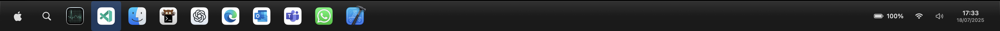
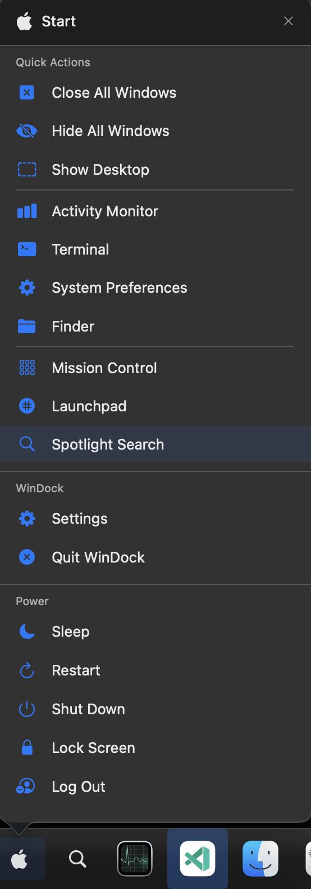

# Win Dock

A feature-rich macOS SwiftUI application that emulates the Windows 11 style taskbar, bringing a modern Windows experience to your Mac.



## Requirements

-   macOS 14 Sonoma or later
-   Xcode 15 or newer (Swift 5.9)

## Quick Start

```bash
git clone https://github.com/barnuri/win-dock.git
cd win-dock
./run.sh
```

## Screenshots

### Taskbar with App Icons


### Start Menu



## Features

### Core Features

-   ✅ Windows 11-style taskbar with centered icons
-   ✅ Click to activate/launch apps
-   ✅ Start Menu with quick actions and power options
-   ✅ System Tray with time, date, battery, and network status
-   ✅ Taskbar positioning (Bottom, Top, Left, Right)
-   ✅ Alt+Tab compatible - appears in app switcher
-   ✅ Pin/unpin favorite applications
-   ✅ Right-click context menus (Show, Hide, Quit, Pin/Unpin)
-   ✅ App hover previews with window count
-   ✅ Running indicator dots
-   ✅ Window count badges
-   ✅ Customizable appearance and behavior

### Customization Options

-   Multiple taskbar positions (Bottom, Top, Left, Right)
-   Auto-hide taskbar functionality
-   Taskbar size options (Small, Medium, Large)
-   Icon centering toggle
-   Transparency and visual effects settings
-   Animation speed adjustment
-   Show/hide labels and system tray
-   Clock format and date format options
-   Search button app selection (Spotlight, Alfred, Raycast)

### Smart App Management

-   Dynamic detection of new apps launching/quitting
-   Persistent pinned applications
-   Proper app state tracking (running, hidden, window count)
-   Smooth animations and hover effects
-   Group multiple windows of the same application

### System Integration

-   Runs as background accessory app
-   Status bar menu for quick access
-   Multi-monitor support
-   All Spaces support
-   Settings import/export for backup and sharing
-   Advanced logging for troubleshooting

## Installation

### Method 1: Using the Run Script

```bash
git clone https://github.com/barnuri/win-dock.git
cd win-dock
./run.sh
```

### Method 2: Build and Run in Xcode

```bash
git clone https://github.com/barnuri/win-dock.git
cd win-dock
open WinDock.xcodeproj
```

Then press ⌘R to build and run the app.

### Method 3: Download Release

1. Go to the [Releases](https://github.com/barnuri/win-dock/releases) page
2. Download the latest version
3. Move to Applications folder and launch

## Contributing

Contributions are welcome! Please feel free to submit a Pull Request.

1. Fork the repository
2. Create a feature branch (`git checkout -b feature/amazing-feature`)
3. Commit your changes (`git commit -m 'Add some amazing feature'`)
4. Push to the branch (`git push origin feature/amazing-feature`)
5. Open a Pull Request

## License

This project is licensed under the MIT License - see the [LICENSE](LICENSE) file for details.
